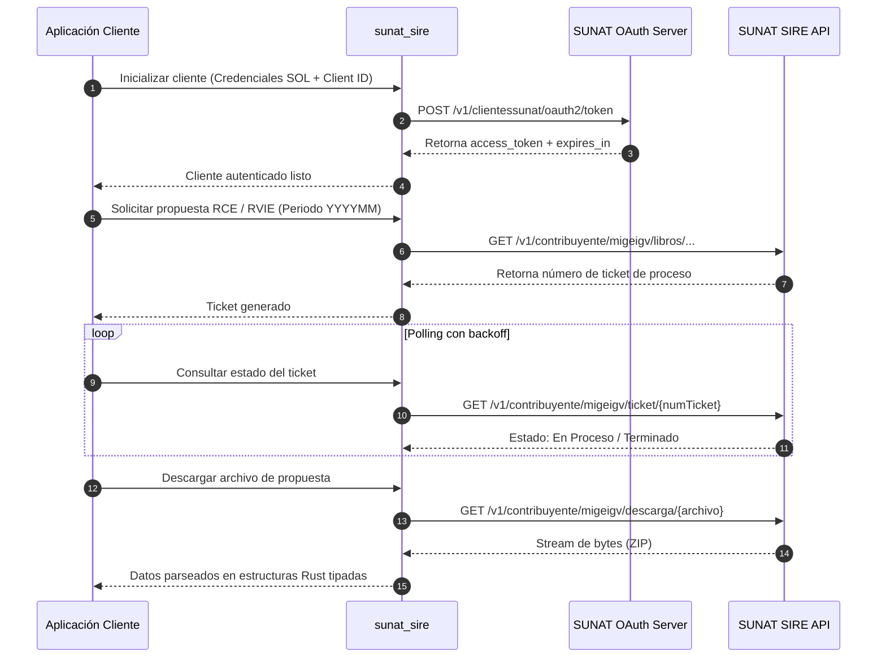

# Manual Técnico — sunat_sire

## 1. Información General del Proyecto

- **Nombre del Crate:** `sunat_sire`
- **Versión:** `0.1.0`
- **Edición de Rust:** `2024` (MSRV: `1.85`)
- **Autor y Titular de Derechos:** César A Vergara Buenaventura (`cesarvergarab@gmail.com`)
- **Licencia:** Doble licencia estándar `MIT` o `Apache-2.0`
- **Propósito:** Proveer una librería robusta, asíncrona y fuertemente tipada en Rust para la integración con los servicios web del **Sistema Integrado de Registros Electrónicos (SIRE)** de la **SUNAT** (Perú).

---

## 2. Principios de Diseño y Estándares Técnicos

El desarrollo de `sunat_sire` se rige de manera obligatoria por los siguientes marcos metodológicos y técnicos:

### 2.1. Karpathy Guidelines
1. **Pensar antes de codificar:** Evaluar supuestos, identificar compensaciones (*trade-offs*) y aclarar ambigüedades antes de escribir código.
2. **Simplicidad primero:** Código mínimo indispensable que resuelve el problema. Evitar abstracciones prematuras y sobreingeniería para casos hipotéticos.
3. **Cambios quirúrgicos:** Tocar estrictamente los bloques y archivos requeridos, respetando el código circundante y preservando el estilo existente.
4. **Ejecución orientada a objetivos:** Cada avance se valida mediante pruebas automatizadas y verificaciones reproducibles.

### 2.2. Rust Best Practices (Apollo Rust Handbook)
- **Borrowing & Ownership:** Priorizar el préstamo (`&T`, `&str`, `&[T]`) sobre la clonación `.clone()`. Uso de `Cow<'_, T>` ante ambigüedad de propiedad.
- **Manejo de Errores:** Errores tipados mediante `Result<T, E>`. Prohibición de `unwrap()` y `expect()` en código de producción. Empleo de `thiserror` para la jerarquía de errores de la librería.
- **Linter y Calidad:** Cumplimiento continuo de `cargo clippy --all-targets --all-features -- -D warnings`.
- **Documentación de Código:** Comentarios de línea (`//`) reservados para justificar decisiones de diseño y motivos arquitectónicos (*por qué*); comentarios rustdoc (`///` y `//!`) para describir interfaces públicas, contratos y parámetros (*qué* y *cómo*).
- **Tipado Fuerte:** Modelado mediante el *Type State Pattern* para validar en tiempo de compilación transiciones de estado (ej. solicitud de ticket -> procesamiento -> descarga).

### 2.3. Rust Async Patterns (Tokio)
- **No bloqueo del hilo ejecutor:** Prohibido el uso de llamadas síncronas bloqueantes (`std::thread::sleep` o E/S estándar síncrona). Uso estricto de los equivalentes asíncronos de Tokio.
- **Seguridad en bloqueos:** Ningún `std::sync::MutexGuard` debe cruzar puntos `.await` para prevenir bloqueos mutuos (*deadlocks*).
- **Control de concurrencia:** Gestión de descargas y peticiones concurrentes mediante `JoinSet`, `Semaphore` y señales de cancelación limpia con `CancellationToken`.
- **Instrumentación:** Integración con la biblioteca `tracing` para emisión de eventos y métricas de diagnóstico.

### 2.4. Estándares de Control de Versiones (Git)
- **Commits obligatorios por fase/interacción:** Al finalizar cada interacción o fase de desarrollo, se genera un commit en Git.
- **Conventional Commits:** Formato de mensajes con prefijos estandarizados (`feat:`, `fix:`, `docs:`, `chore:`, `refactor:`, `test:`, etc.).
- **Nomenclatura de ramas:** `feature/*`, `bugfix/*`, `chore/*`, `docs/*`.

---

## 3. Arquitectura del Sistema

```
sunat_sire/
├── Cargo.toml                  # Manifiesto del proyecto y metadatos de crates.io
├── LICENSE-MIT                 # Términos de licencia MIT
├── LICENSE-APACHE              # Términos de licencia Apache 2.0
├── README.md                   # Documentación general y presentación
├── docs/
│   ├── MANUAL_TECNICO.md       # Este documento (arquitectura y manual técnico)
│   └── histórico/
│       └── HISTORICO_SOLICITUDES.md # Registro cronológico de solicitudes y respuestas
└── src/
    ├── lib.rs                  # Raíz del crate, exportación pública y rustdoc general
    ├── auth/                   # Gestión de tokens OAuth 2.0 con SUNAT (Clave SOL)
    ├── client/                 # Cliente HTTP asíncrono sobre Reqwest/Tokio
    ├── error/                  # Definición jerárquica de errores con thiserror
    └── models/                 # Modelos de datos RCE, RVIE, tickets y propuestas
```

### 3.1. Módulos Principales (Planificados y en Evolución)

1. **`auth` (Autenticación y Autorización):**
   - Implementa el flujo OAuth 2.0 requerido por SUNAT utilizando `client_id`, `client_secret`, RUC del contribuyente, usuario SOL y clave SOL.
   - Cacheo en memoria y refresco automático del Bearer token antes de su caducidad.

2. **`client` (Cliente HTTP Asíncrono):**
   - Configuración base del cliente HTTP con cabeceras requeridas por SUNAT (`Content-Type: application/json`, `Authorization: Bearer <token>`).
   - Gestión de límites de tasa (*rate-limiting*) y reintentos automáticos con retroceso exponencial (*exponential backoff*).

3. **`models` (Dominio SIRE):**
   - **RCE (Registro de Compras Electrónico):** Consulta y gestión de la propuesta de compras, aceptación, complementación o reemplazo de propuesta.
   - **RVIE (Registro de Ventas e Ingresos Electrónico):** Consulta y gestión de la propuesta de ventas e ingresos.
   - **Tickets Asíncronos:** Consulta de estado de tickets de procesamiento masivo emitidos por SUNAT y descarga de archivos de respuesta en formato comprimido (ZIP / CSV / TXT).

4. **`error` (Manejo Centralizado de Errores):**
   - Enumeración exhaustiva de posibles fallos: errores de red, expiración de credenciales, respuestas de validación tributaria devueltas por SUNAT, errores de deserialización y descompresión de archivos.

---

## 4. Flujo Operativo Típico de Integración con SIRE



---

## 5. Comandos de Verificación y Documentación

Para garantizar la integridad y calidad del código en todo momento:

- **Compilación rápida:**
  ```bash
  cargo check
  ```
- **Ejecución de pruebas unitarias y de integración:**
  ```bash
  cargo test
  ```
- **Análisis estático y linter estricto:**
  ```bash
  cargo clippy --all-targets --all-features --locked -- -D warnings
  ```
- **Generación y visualización del manual de código (Rustdoc):**
  ```bash
  cargo doc --no-deps --open
  ```

---

## 6. Política de Mantenimiento

Este documento debe actualizarse obligatoriamente cada vez que:
- Se implemente, refactorice o elimine un módulo o funcionalidad de la librería.
- Se introduzcan nuevas dependencias o requerimientos del entorno.
- Se modifiquen las directrices o estándares técnicos adoptados por el equipo.
