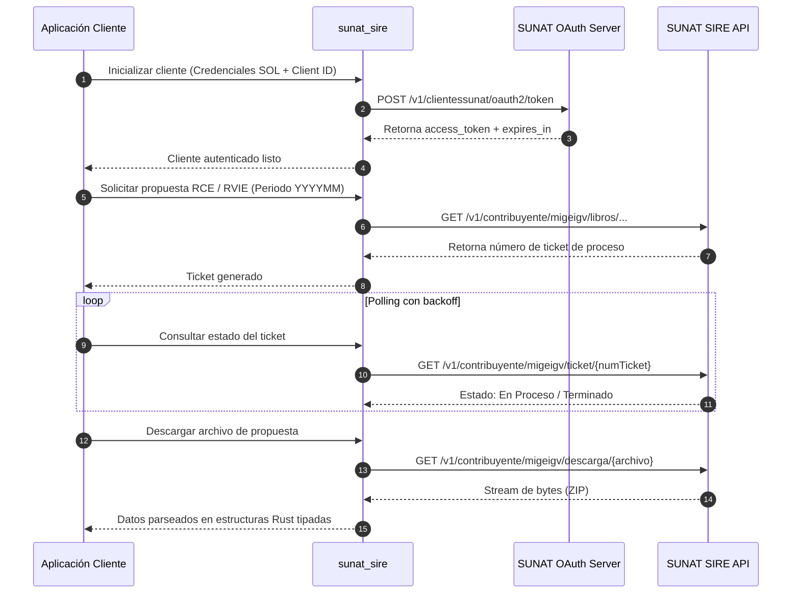

# Manual Técnico — sunat_sire

## 1. Información General del Proyecto

- **Nombre del Crate:** `sunat_sire`
- **Versión:** `0.1.0`
- **Edición de Rust:** `2024` (MSRV: `1.85`)
- **Autor y Titular de Derechos:** César A Vergara Buenaventura (`cesarvergarab@gmail.com`)
- **Licencia:** Doble licencia estándar `MIT` o `Apache-2.0`
- **Propósito:** Proveer una librería robusta, asíncrona y fuertemente tipada en Rust para la integración con los servicios web del **Sistema Integrado de Registros Electrónicos (SIRE)** de la **SUNAT** (Perú).

---

## 2. Principios de Diseño y Estándares Técnicos

El desarrollo de `sunat_sire` se rige de manera obligatoria por los siguientes marcos metodológicos y técnicos:

### 2.1. Karpathy Guidelines
1. **Pensar antes de codificar:** Evaluar supuestos, identificar compensaciones (*trade-offs*) y aclarar ambigüedades antes de escribir código.
2. **Simplicidad primero:** Código mínimo indispensable que resuelve el problema. Evitar abstracciones prematuras y sobreingeniería para casos hipotéticos.
3. **Cambios quirúrgicos:** Tocar estrictamente los bloques y archivos requeridos, respetando el código circundante y preservando el estilo existente.
4. **Ejecución orientada a objetivos:** Cada avance se valida mediante pruebas automatizadas y verificaciones reproducibles.

### 2.2. Rust Best Practices (Apollo Rust Handbook)
- **Borrowing & Ownership:** Priorizar el préstamo (`&T`, `&str`, `&[T]`) sobre la clonación `.clone()`. Uso de `Cow<'_, T>` ante ambigüedad de propiedad.
- **Manejo de Errores:** Errores tipados mediante `Result<T, E>`. Prohibición de `unwrap()` y `expect()` en código de producción. Empleo de `thiserror` para la jerarquía de errores de la librería.
- **Linter y Calidad:** Cumplimiento continuo de `cargo clippy --all-targets --all-features -- -D warnings`.
- **Documentación de Código:** Comentarios de línea (`//`) reservados para justificar decisiones de diseño y motivos arquitectónicos (*por qué*); comentarios rustdoc (`///` y `//!`) para describir interfaces públicas, contratos y parámetros (*qué* y *cómo*).
- **Tipado Fuerte:** Modelado mediante el *Type State Pattern* para validar en tiempo de compilación transiciones de estado (ej. solicitud de ticket -> procesamiento -> descarga).

### 2.3. Rust Async Patterns (Tokio)
- **No bloqueo del hilo ejecutor:** Prohibido el uso de llamadas síncronas bloqueantes (`std::thread::sleep` o E/S estándar síncrona). Uso estricto de los equivalentes asíncronos de Tokio.
- **Seguridad en bloqueos:** Ningún `std::sync::MutexGuard` debe cruzar puntos `.await` para prevenir bloqueos mutuos (*deadlocks*).
- **Control de concurrencia:** Gestión de descargas y peticiones concurrentes mediante `JoinSet`, `Semaphore` y señales de cancelación limpia con `CancellationToken`.
- **Instrumentación:** Integración con la biblioteca `tracing` para emisión de eventos y métricas de diagnóstico.

### 2.4. Estándares de Control de Versiones (Git)
- **Commits obligatorios por fase/interacción:** Al finalizar cada interacción o fase de desarrollo, se genera un commit en Git.
- **Conventional Commits:** Formato de mensajes con prefijos estandarizados (`feat:`, `fix:`, `docs:`, `chore:`, `refactor:`, `test:`, etc.).
- **Nomenclatura de ramas:** `feature/*`, `bugfix/*`, `chore/*`, `docs/*`.

### 2.5. Convención Lingüística y Nomenclatura con Prefijos
- **Idioma del proyecto:** El idioma oficial para el código fuente interno, nombres de tipos, módulos, métodos, documentación y pruebas es el **español**.
- **Uso obligatorio de prefijos:**
  - Tipos, estructuras, enumeraciones y traits adoptan el prefijo `Sire` o `SIRE` (ej. `SireCliente`, `SireConfiguracion`, `SireTicket`, `SireError`).
  - Módulos y funciones adoptan el prefijo `sire_` en minúsculas (*snake_case*) cuando corresponda a la API pública de la librería (ej. `sire_autenticar`, `sire_compras`).
  - **Condición de excepción de API:** Esta nomenclatura se aplica siempre que no colisione, sobreescriba o altere el contrato estricto de la API de SUNAT. Los campos de payloads JSON y respuestas directas de SUNAT (ej. `numTicket`, `codTipoDoc`, `mtoTotal`) preservan los identificadores exigidos por el fisco o se mapean transparentemente mediante atributos `#[serde(rename = "...")]`.

### 2.6. Prohibición de Punto Flotante para Moneda y Análisis de la API SUNAT
- **Regla Estricta:** Se prohíbe taxativamente el uso de tipos de coma flotante binaria (`f32`, `f64`) para representar, calcular o almacenar importes monetarios, bases imponibles, tributos o tipos de cambio.
- **Análisis y Respaldo Técnico según la Especificación de SUNAT SIRE:**
  - Las especificaciones del SIRE (Resoluciones de Superintendencia N.° 000112-2021/SUNAT, 000040-2022/SUNAT y sus anexos de estructuras RCE y RVIE) exigen precisión decimal fija exacta: 2 decimales para importes en moneda nacional/extranjera (Base Imponible, IGV, Total) y 3 decimales para el factor de tipo de cambio.
  - El estándar IEEE 754 de coma flotante binaria (`f32`/`f64`) no puede representar de forma exacta la mayoría de fracciones decimales (por ejemplo, `0.1 + 0.2` resulta en `0.30000000000000004`).
  - Las matrices de validación de SUNAT validan la consistencia aritmética (`BI * 0.18 == IGV`, `BI + IGV == Total`) al céntimo exacto. Un error de redondeo residual de coma flotante resulta en el rechazo del ticket o inconsistencias tributarias no subsanables.
  - **Solución Estándar:** Se adopta de manera obligatoria la biblioteca `rust_decimal` (`Decimal`), la cual provee aritmética en base 10 de 128 bits de precisión exacta sin pérdidas ni redondeos espurios, compatible con serialización y deserialización directa a JSON.

---

## 3. Arquitectura del Sistema

```
sunat_sire/
├── Cargo.toml                  # Manifiesto del proyecto y metadatos de crates.io
├── LICENSE-MIT                 # Términos de licencia MIT
├── LICENSE-APACHE              # Términos de licencia Apache 2.0
├── README.md                   # Documentación general y presentación
├── docs/
│   ├── MANUAL_TECNICO.md       # Arquitectura y manual técnico
│   └── histórico/
│       └── HISTORICO_SOLICITUDES.md # Registro cronológico de solicitudes y respuestas
└── src/
    ├── lib.rs                  # Raíz del crate, exportación pública y rustdoc
    ├── sire_autenticacion/     # Gestión OAuth 2.0 (Clave SOL + Client ID), tokens y ambientes
    ├── sire_cliente/           # Cliente HTTP asíncrono sobre Reqwest/Tokio con backoff y reintentos
    ├── sire_catalogos/         # Tablas y catálogos oficiales SUNAT (Tipos doc, comprobantes, monedas, etc.)
    ├── sire_rce/               # Registro de Compras Electrónico (Nacional y No Domiciliados)
    ├── sire_rvie/              # Registro de Ventas e Ingresos Electrónico
    ├── sire_tickets/           # Gestión asíncrona de tickets de proceso y descargas masivas
    └── sire_errores/           # Jerarquía tipada de errores con thiserror
```

### 3.1. Módulos Principales de la Librería

1. **`sire_autenticacion` (Gestión de Identidad y Ambientes):**
   - `SireAmbiente`: Configuración de URLs de destino (`Produccion`, `PruebasBeta`, `Personalizado`).
   - `SireCredenciales`: Manejo seguro de `client_id`, `client_secret`, `ruc`, `usuario_sol` y `clave_sol`.
   - `SireToken`: Almacenamiento del token Bearer con cálculo de tiempo de expiración y auto-refresco asíncrono con `RwLock`.

2. **`sire_cliente` (Capa de Comunicación Asíncrona):**
   - `SireCliente`: Cliente HTTP construido sobre `reqwest::Client` y `tokio`.
   - Inyección automática de cabeceras de autorización (`Authorization: Bearer <token>`) y metadatos.
   - Políticas de reintento ante fallos transitorios de red o saturación de SUNAT.

3. **`sire_catalogos` (Catálogos Oficiales de SUNAT para SIRE):**
   - Implementación exhaustiva y tipada de las tablas maestras de SUNAT:
     - `SireCatalogo01TipoDocumentoIdentidad` (DNI, RUC, Pasaporte, Cédula Diplomática, etc.)
     - `SireCatalogo02TipoComprobante` (Factura, Boleta, Nota de Crédito, Recibo por Honorarios, etc.)
     - `SireCatalogo03Moneda` (PEN, USD, EUR, etc. según ISO 4217)
     - `SireCatalogo04Pais` (Códigos de país según ISO 3166-1)
     - `SireCatalogo05Aduana` (Dependencias aduaneras de SUNAT)
     - `SireCatalogo11TipoAfectacionIgv` (Gravado, Exonerado, Inafecto, Exportación)
     - `SireCatalogo24TipoOperacion` (Operaciones internas, exportaciones)
     - `SireEstadoPropuesta` y `SireEstadoTicket` (Códigos de estado en respuestas del SIRE)

4. **`sire_rvie` (Registro de Ventas e Ingresos Electrónico):**
   - Estructuras para Comprobantes de Venta (`SireComprobanteVenta`, montos en `Decimal`).
   - Gestión de propuestas: consulta de propuesta, aceptación de propuesta, reemplazo de propuesta mediante carga de archivo plano/ZIP, inclusión/exclusión de documentos.

5. **`sire_rce` (Registro de Compras Electrónico):**
   - Submódulo Nacional (`sire_rce_nacional`) y No Domiciliados (`sire_rce_no_domiciliados`).
   - Modelado de las casillas tributarias (adquisiciones gravadas con derecho a crédito fiscal, operaciones no gravadas, etc.).
   - Consulta, complementación y reemplazo de la propuesta de compras.

6. **`sire_tickets` (Gestión de Procesos Asíncronos y Descargas):**
   - Monitoreo del ciclo de vida de tickets de SUNAT con polling asíncrono configurable (`SireConsultaTicket`).
   - Descarga de archivos masivos generados por SUNAT (descompresión ZIP en memoria o disco y parseo a registros tipados).

7. **`sire_errores` (Manejo de Errores Tipados):**
   - `SireError`: Enum que agrupa errores de autenticación, errores de red, respuestas HTTP no exitosas de SUNAT, errores de validación local y fallos de deserialización.

---

## 4. Flujo Operativo Típico de Integración con SIRE



---

## 5. Comandos de Verificación y Documentación

Para garantizar la integridad y calidad del código en todo momento:

- **Compilación rápida:**
  ```bash
  cargo check
  ```
- **Ejecución de pruebas unitarias y de integración:**
  ```bash
  cargo test
  ```
- **Análisis estático y linter estricto:**
  ```bash
  cargo clippy --all-targets --all-features --locked -- -D warnings
  ```
- **Generación y visualización del manual de código (Rustdoc):**
  ```bash
  cargo doc --no-deps --open
  ```

---

## 6. Política de Mantenimiento

Este documento debe actualizarse obligatoriamente cada vez que:
- Se implemente, refactorice o elimine un módulo o funcionalidad de la librería.
- Se introduzcan nuevas dependencias o requerimientos del entorno.
- Se modifiquen las directrices o estándares técnicos adoptados por el equipo.
